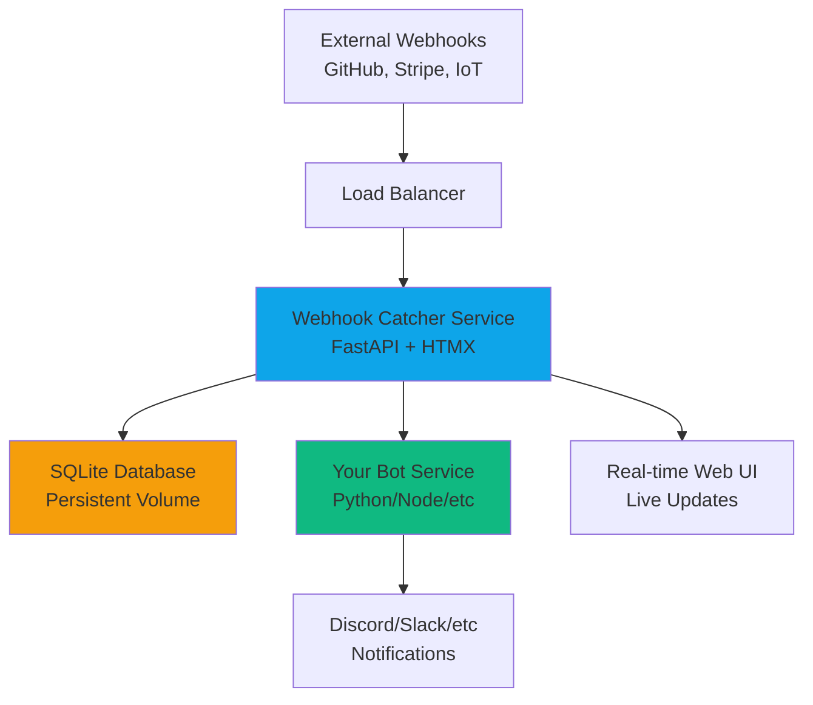
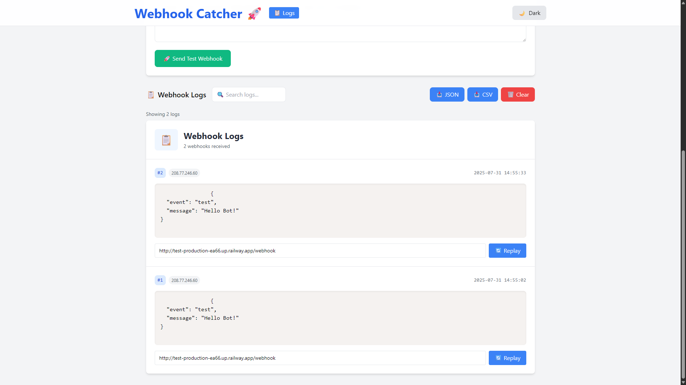
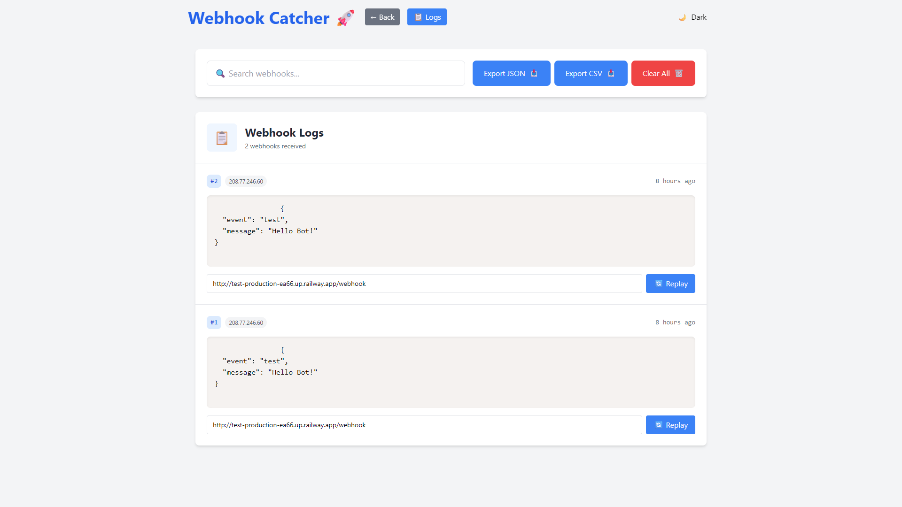

# Webhook Catcher

> The easiest way to capture and debug webhooks in production and development.

A developer-friendly webhook debugging tool — ideal for testing GitHub/Stripe events, bot integrations, or any webhook-based workflow.  
Replay, filter, and forward webhooks in real time with zero config.

---

## Features

- Capture and view incoming webhooks in real time
- Search, filter, and export webhook logs
- Replay webhooks to any target URL
- Multi-service ready: forward webhooks to your own bot/service
- **Production-ready admin protection** for sensitive operations
- Deploy instantly on Railway or any platform

---

## 🚀 Deploy on Railway (Recommended)

⚡ **Why Railway?**

Webhook Catcher is optimized for Railway:

- 🧠 Zero config — deploy in seconds
- 🪄 Auto-generated domain (instantly test your webhook)
- 🔐 Built-in secret management & protection
- 📈 Scalable — from solo devs to production

---

## ✨ Sophisticated Architecture Overview



---

## 🧩 Use Cases

- Debug Stripe or GitHub webhooks in production
- Build and test bots for Discord, Telegram, or Slack
- Capture IoT webhook payloads for later processing
- Replay webhooks to local dev or staging environments

---

## Quick Start

1. **Deploy on Railway:**  
   [](https://railway.app/new/template/K2iWVB?referralCode=nIQTyp)

2. **Send a webhook:**  
   Use your deployed `/webhook` endpoint with any service or tool (e.g., GitHub, Stripe, curl).

   ```bash
   curl -X POST https://your-app.railway.app/webhook \
     -H "Content-Type: application/json" \
     -d '{"event": "test", "message": "Hello"}'
   ```

3. **View and replay webhooks:**  
   Open the web UI to see logs, search, export, or replay to another URL.

---

## Screenshots




---

## 🔧 Configuration

### Environment Variables

| Variable | Description | Required | Default |
|----------|-------------|----------|---------|
| `FORWARD_WEBHOOK_URL` | Forward incoming webhooks to another service | No | - |
| `FORWARD_WEBHOOK_TOKEN` | Authentication token for secure forwarding | No | - |
| `ADMIN_TOKEN` | **Admin protection token for sensitive operations** | No | - |

### 🔒 Admin Protection (Production Feature)

The `ADMIN_TOKEN` environment variable provides **production-grade security** for sensitive operations:

#### Protected Operations:
- **Clear all logs** (`POST /clear`)
- **Replay webhooks** (`POST /replay/{id}`)

#### Security Modes:

**1. No Protection (Development)**
```bash
# Leave ADMIN_TOKEN empty or unset
ADMIN_TOKEN=""
```
- All operations are publicly accessible
- Perfect for development and testing

**2. Token Protection (Production)**
```bash
# Set a strong admin token
ADMIN_TOKEN="your-secret-admin-token-123"
```
- Admin operations require authentication
- Token can be provided via:
  - Header: `X-Admin-Token: your-secret-admin-token-123`
  - Query parameter: `?admin_token=your-secret-admin-token-123`

#### Usage Examples:

**Clear logs with admin token:**
```bash
# Via header (recommended)
curl -X POST "https://your-app.railway.app/clear" \
  -H "X-Admin-Token: your-secret-admin-token-123"

# Via query parameter
curl -X POST "https://your-app.railway.app/clear?admin_token=your-secret-admin-token-123"
```

**Replay webhook with admin token:**
```bash
curl -X POST "https://your-app.railway.app/replay/1?target_url=https://httpbin.org/post" \
  -H "X-Admin-Token: your-secret-admin-token-123"
```

**Health check shows protection status:**
```bash
curl https://your-app.railway.app/healthz
# Returns: {"status": "ok", "admin_protected": true}
```

#### Security Best Practices:
- Use a strong, random token (minimum 20 characters)
- Keep the token secret and rotate it regularly
- Use headers instead of query parameters when possible
- Enable admin protection for production deployments

---

## Advanced Features

### Multi-Service Architecture
- **Internal networking**: Link your own service using `FORWARD_WEBHOOK_URL`
- **Secure forwarding**: Use `FORWARD_WEBHOOK_TOKEN` for authenticated service-to-service communication
- **Real-time processing**: Forward webhooks immediately while storing for replay

### Data Persistence
- **SQLite database** with volume mounting
- **Export capabilities**: JSON and CSV formats
- **Search functionality**: Full-text search across webhook payloads
- **Replay system**: Resend any webhook to any URL

### Modern UI/UX
- **Real-time updates** with HTMX and Server-Sent Events
- **Dark/light mode** with system preference detection
- **Responsive design** optimized for mobile and desktop
- **Syntax highlighting** for JSON payloads with Prism.js

---

## Platform Features

This template is optimized for modern cloud platforms:

✅ **One-click deployment** with railway.json template  
✅ **Environment variable management** for configuration  
✅ **Volume persistence** for SQLite database storage  
✅ **Health checks** for service monitoring  
✅ **Internal networking** for multi-service communication  
✅ **Production security** with admin token protection  
✅ **Modern web stack** (FastAPI + HTMX + TailwindCSS)  
✅ **Cross-platform compatibility** (Unix/Windows/PowerShell)

---

## License

MIT License - Use freely for personal and commercial projects.
